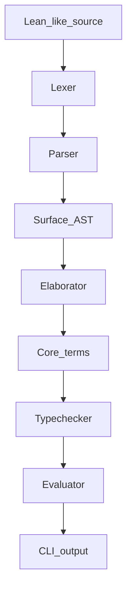

# Lightweight Lean Compiler

A tiny Rust compiler stack for a Lean 4-like surface language. It parses a small dependent lambda calculus, elaborates it into core terms, typechecks definitions, and evaluates `#eval` commands by normalization.



## Run

```sh
cargo run -- examples/basic.lean
cargo run -- examples/programming.lean
cargo run -- examples/recursion.lean
cargo run -- examples/options.lean
cargo run -- --expr "#eval id Type Type"
cargo run -- --help
```

## Test

```sh
cargo test
```

## Supported Syntax

```lean
def id : (A : Type) -> A -> A := fun A : Type => fun x : A => x
def two : Nat := 1 + 1
def not : Bool -> Bool := fun b : Bool => match b with | true => false | false => true
def lengthNat : List Nat -> Nat := fun xs : List Nat => match xs with | nil => 0 | cons x rest => 1 + lengthNat rest
#eval id Type Type
#eval let x : Nat := two; x + 40
#eval lengthNat (cons Nat 1 (cons Nat 2 (nil Nat)))
```

Supported terms: `Type`, `Nat`, `Bool`, `Option A`, `List A`, natural number literals, identifiers, constructor applications, `fun x : A => body`, `A -> B`, `(x : A) -> B`, `left + right`, `let x : A := value; body`, `match x with | pat => body`, structural recursion over simple matches, and parentheses.
