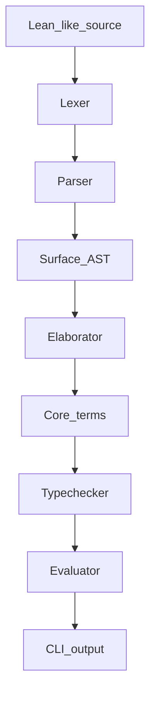

# Lightweight Lean Compiler

A tiny Rust compiler stack for a Lean 4-like surface language. It parses a small dependent lambda calculus, elaborates it into core terms, typechecks definitions, and evaluates `#eval` commands by normalization.



## Run

```sh
cargo run -- examples/basic.lean
cargo run -- --expr "#eval id Type Type"
```

## Supported Syntax

```lean
def id : (A : Type) -> A -> A := fun A : Type => fun x : A => x
#eval id Type Type
```

Supported terms: `Type`, identifiers, applications, `fun x : A => body`, `A -> B`, `(x : A) -> B`, and parentheses.
